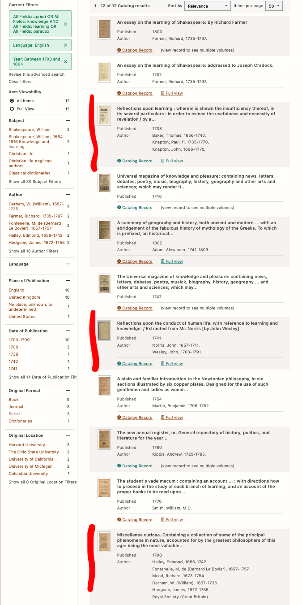

# The Initial Question
I was inspired by Immanuel Kant, a German philoospher who lived from 1724 to 1804, famous for his works on subjects such
as epistemology, metaphysics, and ethics. 

My interest spiked after reading Kant's _Prolegomena_, specifically on his arguments concerning the differences between analytical and synthetical knowledge, and how from that it follows that math cannot be considered fully _a priori_ kind of knowledge, made me recall similar arguments about knowledge. 

For example, going back to ancient philosophy, I recall Socrates’ argument in _Meno’s Paradox_ and how he uses Meno’s slave to show that we are born with all the knowledge wen will ever need. All that is required of one is to inquire within. For example, in this example Meno’s slave is able to display geometric properties about squares through socratic questioning despite never given lessons in geometry before. Meno’s paradox showed that one cannot inquire into what we don’t know, and we also cannot know what it is that we don’t know since we do not know it, hence making it impossible to learn anything and why Socrates believed we get all knowledge from our soul

Some questions that this made me curious about was the connection between Kant’s thoughts on knowledge and learning:

>### _Was he influenced by the ideas of ancient philosophers? Were there any other philosophers during his time that held a similar view of mathematics as he did? Or were his ideas more novel? If not, is there someone who inquired about this before Kant made such arguments famous to the overall public? And perhaps deeper, and harder questions to answer, such as wondering whether Kant, like Socrates, would agree that any type of learning is impossible?_

# The Narrowed Question
Some problems the initial question posed were the ability to find primary sources in English. Given that Kant was a German philosopher, related works, and works that could have possibly influenced him, were most likely to be in German or Latin. Ironically, broadening the initial question from focusing less on Kant but more to English works during the 18th century helped mitigate this. (Who knew a narrowed question would actually end up being a bit more general in this case?)

>### _What were the popular arguments on learning and knowledge in the 18th century, and how common were arguments about the paradox nature of learning during this time period?_

This question still allows me to still explore ideas that I had in my general question, such as exploring Kant’s possible inspiration for formulating such thoughts about _a posteriori_ and _a priori_ knowledge, and whether any such discussions were popular in the 18th century. This allows me to also explore whether Kant’s argument was truly novel or whether hewas simply popularizing ideas that were already being surfaced by other philosophers of the time.

# The Process
**Finally**, what we have all been waiting for - the 'meat' of this whole project - the process to answer this question. 

I primarily used the _[HATHI TRUST Digital library](https://www.hathitrust.org)_ to conduct all my searches for primary sources during the 18th century, as well as other resources like Google and _[Britannica](https://www.britannica.com)_ to get supplementary information on the author's of the texts I read on HATHI. 

My first few searches resulted in thousands of hits, which wasn't useful since I will have to read through the texts to find what is relevant to my question. Hathi has support for advanced searches using tools boolean operators to match words and the ability to only get search results written in a particular language and in a certain time period. This allowed me to narrow down my search to only include texts in English published in the 18th century, which is the time period Kant was alive. 

Using the advanced search tools, I was able to narrow down my results from thousands of hits to just 12 (sucess!). If you'd like to replicate my narrowed search, simply click [here](https://catalog.hathitrust.org/Search/Home?adv=1&lookfor%5B%5D=apriori&type%5B%5D=all&lookfor%5B%5D=knowledge&type%5B%5D=all&bool%5B%5D=OR&lookfor%5B%5D=learning&type%5B%5D=all&bool%5B%5D=AND&lookfor%5B%5D=paradox&type%5B%5D=all&bool%5B%5D=OR&yop=between&fqor-language%5B%5D=English&fqrange-start-publishDateTrie-1=1700&fqrange-end-publishDateTrie-1=1804), or if you'd like to replicate it manually yourself, here is a screenshot of the parameters I passed in the advanced search tool:

Here's a screenshot of the results you get by running this search:

As you can see, this search only brings up 12 hits, which is much more manageable. Quickly skimming through the titles and content of some of the texts this search surfaced (I'm looking at you text about Shakespeare!), we can see that not all of them are relevant to the question. I have focused on the three texts highlighted in the screenshot above, and will analyze them in more detail below. 

## _Reflections upon learning : wherein is shewn the insufficiency thereof, in its several particulars..._ - Thomas Baker (1656 - 1740)

[Link to Text](https://babel.hathitrust.org/cgi/pt?id=hvd.hw1x7s&view=1up&seq=32)

Thomas Baker was a clergyman and antiquary (someone who studies ancient artifacts/history) who studied at St. John's College in London. He spent most of his life in this college, continuing his antiquary book and writing texts, embarking on his largest production being this one, _Reflections Upon Learning_. However, much of his work led to nothing, as his fellowship at the college was terminated and he died at the age of 83 from a stroke. Despite his anger at the college, he left all of his works to them, so many that the college says they had to lift the ceiling of one of the libraries to fit the entire collection. Overall, Baker seemed like a man whose projects never really led anywhere and were never celebrated, to read more about him you can go [here](https://www.joh.cam.ac.uk/library/special_collections/early_books/baker.htm)

In _Reflections Upon Learning_, Baker attempts to bring to light the faults in our human understanding, concluding that the only thing that is certain is the revelation we will get from God (he was a clergyman after all). Unfortunately, this is all he did, as the work seems more like 300+ pages of critique against ancient philosophers like Plato and Aristotle, and sometimes even against Descartes, but fails to bring about any counterarguments.

The text is split into 12 chapters, each dealing with a different subject. To limit the amount I had to read, and to focus on parts that may hold argument similar to kant's, I focused on Chapter 5: Of Logic, Chapter 6: Of Logic, and Chapter 7: Of Natural Philosophy. 

The chapter that I found the most interesting was the one having to due with Natural Philosophy, as it deals with final causes and our inability to accurately conclude the cause of anything. Baker criticizes the projects of ancient philosophers who sought to find the basis for the universe is built on, and how they belived the cause of everything was water (similar to how we now view atoms as making up everything in the universe). Thomas argues that since ideas like these change constantly, it is unreasonable to ever think that we have successfully acquired the knowledge needed to ever know anything. Instead, we should rely on God and what we can learn from him, but he offers no clear process on how to go about this.

## _Reflections upon the conduct of human life: with reference to learning and knowledge._ - John Norris (1657–1711)
[Link to Text](https://babel.hathitrust.org/cgi/pt?id=emu.000015257572&view=1up&seq=1)

John Norris was an English philosopher and associated with the Cambridge platonists. Unlike Thomas Baker, he was actually pretty famous and corresponded with other philosophers of the time, such as Henry More. 

In _Reflections Upon the Conduct of Human Life_, Norris talks about his devotion to seeking truth and his reflections upon the subject, which all revolve around seeing God as the ultimate source of truth. He argues that truths must relate to ideas that are "eternal and immutable" and so God being the highest example of this, every truth we can seek is simply an essence of God. In the page below, we can see an example of this, as he says towards the end that "God is the Region of Truth, and in him bid all the Treasures of Wisdom and Knowledge." 

Norris reminds me much of Benedict de Spinoza, as he alsos beleives that God is the cause of all things. We see everything in God and know of things only through him. 

## _Miscellanea curiosa._ - Edmund Halley (1656 - 1742)
[Link to Text](https://babel.hathitrust.org/cgi/pt?id=hvd.hxkm2p&view=1up&seq=19)

If you've ever taken an astronomy class, you're probably familiar with Edmund Halley - [Does Halley's Comet ring a bell?](https://www.space.com/19878-halleys-comet.html) Halley was an astronomer famous for discovering the closest observable comet as well as one of the authors who worked with Isaac Newton on _Philosophiæ Naturalis Principia Mathematica_. (I bet Thomas Baker wishes he was even a bit as famous as him)

I chose this text because it was a striking difference to the other two texts I read. Instead of focusing on God as the one true source of knowledge like Norris and Baker did, Halley's compilation of works is a stark contrast with its praise of mathematics and science. 

This collection, which Edmund presents to the _Royal  Society_, begins with a preface by him in which he ackowledges that such subjects aren't known by most, and some may even view them as unimportant, and yet they hold the key to our survival. He says that "people very readily call useless what they don't understand." and math being one of these subjects, it is readily labeled as such. 

In the next page, Edmund exclaims how despite such ignorance, everyday people use scientific discoveries to aid them in their life. He uses sailors as an example, using the stars to navigate, and yet they hold no knowledge of the astronomer and geometricist who came up with the theories to make this type of navigation possible. 

# In Conclusion
 And the answer is...well...it's complicated.

Like all things in philosophy, we never really have a clear answer to things, but at least now we have a clearer perspective of the arguments that existed at the time. 

It seems that while some philosophers and thinkers in the 18th century were concerned with theories of knowledge and learning, none of them held a counter-theory or argument to explain how we should deal with our limits on knowledge. Most were concerned with God and using him as an answer to everything, as we've seen with Norris and Baker, but these ideas weren't exactly Novel at the time as Descartes and Spinoza had previously presented arguments for the existence of God and why God is the cause of all things. 

While Halley's text stands in contrast to the other two, it isn't a philosophical approach to learning and knowledge and does not confront the issues that plague our limited understanding of the world. 

When concerned with the 18th century and limiting ourselves only to texts in English, we can see that while Kant's issues with knowledge weren't anything new, it's his arguments concerning math and _a posteriori / a priori_ knowledge that are novel. However, we must consider the limitations that our answer is constrained to since we are unable to explore texts in German and Latin, texts that were much more accessible to Kant and were more likely to influence his arguments. 